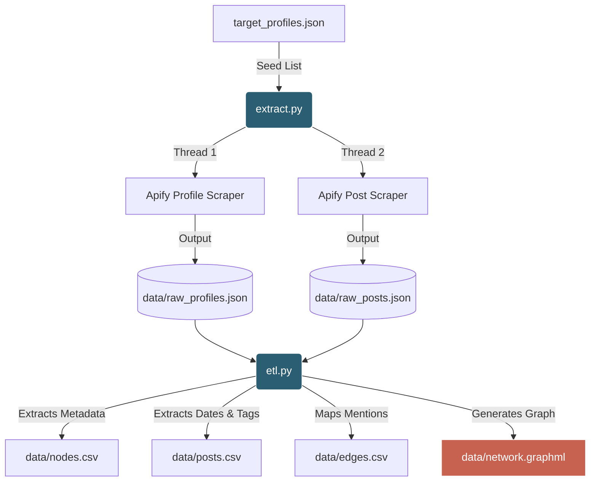

# Instagram Network Mapper


A scalable, Python-based ETL pipeline for extracting public Instagram profile metadata and network connections (mentions) to construct social graphs. Designed to map digital ecosystems, communities, or corporate networks using the Apify API.

## 🌟 Overview & Broad Applicability

This project was originally designed to map the experimental music festival circuit across Germany, Austria, and Switzerland. However, the architecture is **broadly applicable to any community mapping project**. 

By simply swapping out the seed list of Instagram handles, researchers and developers can use this pipeline to:
* Map influencer networks and brand affiliations.
* Analyze cross-promotional ecosystems (e.g., who mentions who).
* Extract bulk metadata (bios, links, follower ratios) without relying on Meta's official Graph API or complex IRB/SOMAR compliance pipelines.

## 🏗️ Architecture & Data Flow



## ⚙️ Configuration & Installation

1. **Install Dependencies**
   The project requires `apify-client`, `pandas`, `networkx`, and `tenacity`.
   ```bash
   pip install -r requirements.txt
   ```

2. **Apify API Token**
   This pipeline relies on Apify for headless data extraction (avoiding the need for personal Instagram logins or cookies).
   * Rename `.env.example` to `.env`.
   * Add your Apify API Token: `APIFY_API_TOKEN=apify_api_...`
   * *(Optional)* Adjust `MAX_POSTS_PER_PROFILE=5` to control extraction depth and credit consumption.

## 🚀 Usage

**Step 1: Define Targets**
Add your target Instagram handles to `target_profiles.json`.

**Step 2: Run Extraction**
Executes concurrent API calls to Apify. It includes exponential backoff and retry logic (`tenacity`) to gracefully handle rate limits.
```bash
python extract.py
```

**Step 3: Run ETL Processing**
Parses the raw JSON payloads into clean, relational CSVs and a NetworkX GraphML file.
```bash
python etl.py
```

## 📁 Input / Output Structure

* **`data/nodes.csv`**: Contains profile IDs, bio text, parsed bio hashtags, follower/following counts, extracted external URLs, and location data (if exposed).
* **`data/posts.csv`**: A ledger of recent posts, capturing the post URL, exact publication date, engagement metrics, and caption hashtags.
* **`data/edges.csv`**: A weighted list mapping source accounts to target accounts based on `@mentions` within post captions.
* **`data/network.graphml`**: The unified network graph file, ready for immediate import into visualization software like **Gephi** or **Cytoscape**.
