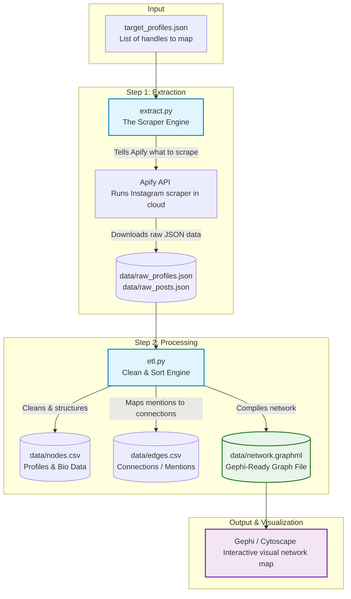
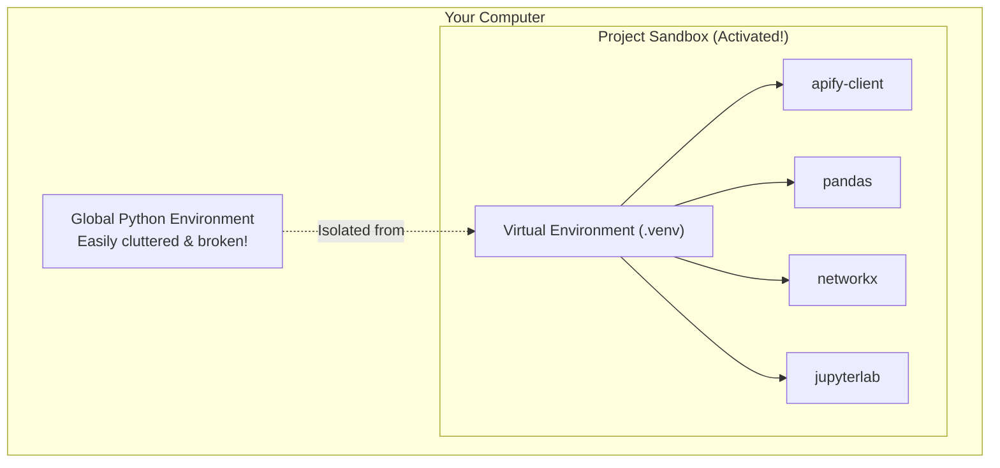
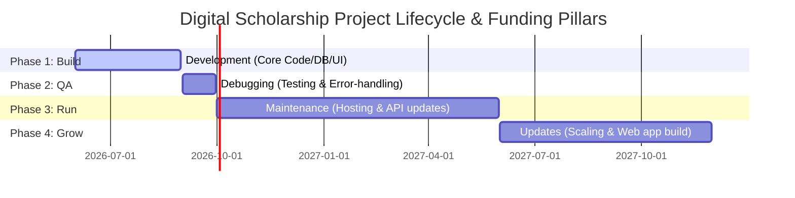

# Beginner's Guide: Instagram Network Mapper

Welcome! If you have never written a line of code, cloned a repository, or opened a black terminal window before, **you are in the right place**. 

This guide will help you set up and run the Instagram Network Mapper on your computer. This tool extracts public Instagram data (such as bios, follower counts, and posts) and maps out how different accounts mention each other, creating a visual network of digital communities.

To make this as accessible as possible, every step offers **two paths**:
*   **🖱️ The Point-and-Click Path:** Uses visual desktop and web applications. **No coding or terminal required!**
*   **💻 The Command Line Path:** Uses text commands, leveraging **The Carpentries** curriculum (the industry standard for scientific research computing).

Choose whichever path feels most comfortable to you!

---

## How the Whole Pipeline Works (At a Glance)

Before running any commands, it helps to understand the journey your data takes. Below is a map of how the system operates from start to finish:



---

## Step 1: Choosing Your Path & Learning Core Skills

Before proceeding, choose your path and familiarize yourself with these free, high-quality, beginner-focused training materials:

### 🖱️ The Point-and-Click Pathway
This pathway uses standard visual software. If you can download a file, drag and drop, and click icons, you can run this entire mapper.
*   **Version Control:** We will download a simple `.zip` file from GitHub, or use **[GitHub Desktop](https://desktop.github.com/)**—a free, visual, point-and-click app.
*   **Python & Jupyter:** We will use **[Anaconda Navigator](https://www.anaconda.com/download/)**—a free visual dashboard that lets you launch programming environments with a single click, or **[Google Colab](https://colab.research.google.com/)**—a web-app where you can run notebooks entirely in your browser with zero installation.

### 💻 The Command Line Pathway (The Carpentries)
This pathway is taught globally to researchers. It teaches you how to type commands directly into your computer to automate tasks.
*   **The Unix Shell Lesson:** [Software Carpentry: The Unix Shell](https://swcarpentry.github.io/shell-novice/) (Learn to navigate folders and run files with text).
*   **The Python Lesson:** [Software Carpentry: Plotting and Programming in Python - Running and Quitting](https://swcarpentry.github.io/python-novice-gapminder/01-run-quit.html) (Learn how code runs inside Jupyter Notebooks).
*   **The Git Lesson:** [Software Carpentry: Version Control with Git](https://swcarpentry.github.io/git-novice/) (Learn to track and download code with Git).

---

## Step 2: Preparing Your Computer

Let's get Python and Git set up on your machine. Choose your preferred approach below:

### 🖱️ The Point-and-Click Path (Recommended for Absolute Beginners)
1.  **Download Anaconda:** Go to the **[Anaconda Downloads Page](https://www.anaconda.com/download/)** and download the installer for Windows, Mac, or Linux.
2.  **Run the Installer:** Double-click the downloaded file and follow the visual on-screen prompts.
    *   *Why Anaconda?* Anaconda installs Python, JupyterLab, and all standard data science libraries (like `pandas`) in one package. It includes **Anaconda Navigator**, a visual desktop dashboard that manages your programs for you.
3.  **Download GitHub Desktop (Optional):** Go to the **[GitHub Desktop Page](https://desktop.github.com/)**, download, and install it to visually manage code.

---

### 💻 The Command Line Path (Carpentries Method)
1.  **Install Git:**
    *   *Mac:* Open your terminal (press `Cmd + Space`, type `Terminal`, hit Enter) and type: `git --version`. If not installed, Mac will prompt you to install Xcode Command Line Tools.
    *   *Windows:* Download and run [Git for Windows](https://git-scm.com/download/win). Keep default settings.
    *   *Linux:* Run `sudo apt install git`.
2.  **Install Python (Version 3.9+):**
    *   Download the installer from the [Official Python Downloads Page](https://www.python.org/downloads/).
    *   **⚠️ WINDOWS GOTCHA:** You **MUST** check the box at the bottom that says **"Add Python to PATH"** before clicking install. If you forget this, your terminal won't recognize Python commands.

```
┌──────────────────────────────────────────────────────────┐
│  Python 3.XX Setup                                       │
├──────────────────────────────────────────────────────────┤
│                                                          │
│  [ Install Now ]                                         │
│                                                          │
│  [x] Add python.exe to PATH   <--- MUST CHECK THIS!      │
└──────────────────────────────────────────────────────────┘
```

---

## Step 3: Getting the Code

Now, let's download the Network Mapper code to your computer.

### 🖱️ The Point-and-Click Path
1.  **Download the ZIP:** Go to the GitHub page for this project. Click the green **Code** button at the top-right, and click **Download ZIP**.
2.  **Extract the Folder:** Locate the downloaded `.zip` file in your Downloads folder, double-click it, and extract it to a clean location (like your Desktop or Documents).
3.  **Alternative (GitHub Desktop):** Open the GitHub Desktop app, click **Clone a Repository from the Internet**, paste the project's URL, and click **Clone**.

---

### 💻 The Command Line Path
1.  Open your Terminal (Mac) or Git Bash / PowerShell (Windows).
2.  Type this command to download the code and press Enter:
    ```bash
    git clone https://github.com/your-username-or-repo/instagram-network-mapper.git
    ```
3.  Move your terminal inside the project folder:
    ```bash
    cd instagram-network-mapper
    ```

---

## Step 4: Installing Project Ingredients

This program relies on external libraries: `pandas` to structure spreadsheets, `networkx` to map connections, `apify-client` to scrape data, and `jupyterlab` to provide an interactive dashboard. Let's install them:

> 💡 **The Sandbox Analogy:** Think of a Python Virtual Environment like a clean kitchen counter. You only fetch the exact ingredients (libraries) needed for *this* recipe, keeping them isolated from other recipes on your computer. This prevents library version conflicts!



### 🖱️ The Point-and-Click Path (Using Anaconda Navigator)
1.  Open the **Anaconda Navigator** application on your computer.
2.  On the left-side menu, click on **Environments**.
3.  At the bottom of the screen, click the **Create** button (the plus icon) to create a new, isolated project sandbox.
    *   Name it: `network-mapper`.
    *   Select Python version `3.10` or higher, then click **Create**.
4.  Once created, click the green play arrow next to `network-mapper` and select **Open Terminal**.
5.  In the terminal that pops up, type the following command to install the required libraries, then hit Enter:
    ```bash
    pip install apify-client pandas python-dotenv networkx tenacity jupyterlab
    ```
6.  You can now close this terminal!

---

### 💻 The Command Line Path (Virtual Environment Method)
In your terminal, create and activate a virtual environment to prevent library version conflicts:

#### For macOS & Linux:
```bash
python3 -m venv .venv
source .venv/bin/activate
```
#### For Windows:
*   *If using Git Bash:*
    ```bash
    source .venv/Scripts/activate
    ```
*   *If using PowerShell:*
    ```powershell
    .venv\Scripts\Activate.ps1
    ```

#### Install Requirements:
Once activated (you will see `(.venv)` in your terminal prompt), run:
```bash
pip install -r requirements.txt
```

---

## Step 5: Getting Your Apify Access Token

Instagram blocks standard web scraping. To bypass this safely, we use **[Apify](https://apify.com/)**, which runs secure scrapers in the cloud without using your personal Instagram account (protecting your personal profile from being flagged or banned).

1.  **Sign Up:** Go to **[Apify's Sign-Up Page](https://apify.com/)** and create a free account.
2.  **Copy Your Token:**
    *   Log into your Apify Console.
    *   Go to **Settings** (gear icon, bottom-left) > **Integrations**.
    *   Copy your **API Token** (starts with `apify_api_...`).
3.  **Configure Your `.env` File:**
    *   In your project folder, find the file called `.env.example`.
    *   **Rename the file** to exactly `.env` (removing the `.example` suffix).
    *   Open `.env` in a plain text editor (Notepad on Windows, TextEdit on Mac, or VS Code. **Do not use Microsoft Word!**).
    *   Replace `your_apify_api_token_here` with your actual token. It should look like this:
        ```env
        APIFY_API_TOKEN=apify_api_A1b2C3d4E5f6G7h8I9j0
        ```
    *   Save and close the file.

---

## Step 6: Customizing Your Targets

Who do you want to map? The project comes preloaded with a list of 18 experimental music festivals in Germany, Austria, and Switzerland. You can easily customize this!

Open `target_profiles.json` in your plain text editor. It looks like this:

```json
[
  {
    "name": "Münchener Biennale",
    "instagram_handle": "muenchenerbiennale"
  },
  {
    "name": "Positionen (journal)",
    "instagram_handle": "positionenmusik"
  }
]
```

### 🛑 Avoid the "JSON Gotchas" (Common Pitfalls)
JSON is a highly strict format. If you make a typo, the program will crash. Watch out for these three rules:
1.  **No "Smart" Quotes:** Ensure you use plain typewriter double-quotes (`"`) and **not** curly word-processor quotes (`“` or `”`).
2.  **No Trailing Commas:** Put a comma `,` between items, but **do not** put a comma after the very last item in the list.
3.  **Exact Handles Only:** Double-check that `instagram_handle` matches the account's handle exactly, without the `@` symbol (use `lucernefestival`, not `@lucernefestival`).

> 💡 **Beginner Tip:** If your program crashes saying "JSON Decode Error", copy your JSON text and paste it into **[JSONLint](https://jsonlint.com/)**. It will instantly highlight exactly which line has the typo!

---

## Step 7: Running the Pipeline via Jupyter Notebooks

Following The Carpentries methodology, we will launch **JupyterLab** to run our pipeline interactively. This lets us run scripts step-by-step and inspect our spreadsheets directly in our web browser!

### 1. Launch JupyterLab

#### 🖱️ The Point-and-Click Path
1.  Open **Anaconda Navigator**.
2.  At the top of the dashboard, ensure the "Applications on" dropdown is set to your `network-mapper` environment.
3.  Locate the **JupyterLab** tile and click **Launch**.
4.  *Your web browser will automatically open with your Jupyter dashboard!*

#### 💻 The Command Line Path
Ensure your terminal is in your project directory and virtual environment `(.venv)` is activated, and type:
```bash
jupyter lab
```

---

### 2. Run the Network Mapper Interactively

Once JupyterLab opens in your browser:
1.  Look at the left-hand folder navigation panel. Double-click to navigate into your extracted `instagram-network-mapper` directory.
2.  Create an interactive notebook file:
    *   Under the **Notebook** section in the main panel, click the **Python 3 (ipykernel)** button.
    *   Right-click the new `Untitled.ipynb` tab on the left panel, select **Rename**, and name it `instagram_mapper.ipynb`.
3.  You will see an empty horizontal box called a **Cell**. We will paste and run code in these cells step-by-step!

---

### 3. Step-by-Step Execution

#### Cell 1: Scrape the Raw Data from Instagram
Paste the following command in the first cell, and press **`Shift + Enter`** (or click the Play icon in the top toolbar):

```python
# Cell 1: Run the scraper to fetch raw profile and post data
%run extract.py
```
*   **What happens:** This connects to Apify and downloads raw profile metadata and recent posts. Progress logs will print below the cell. It takes about 1–3 minutes to complete.
*   **Result:** A new `data` folder appears on the left panel containing raw JSON files.

#### Cell 2: Clean and Organize the Data (ETL)
Click the `+` button in the top toolbar to add a new cell. Paste this command and press **`Shift + Enter`**:

```python
# Cell 2: Clean and restructure the raw data into spreadsheets and graphs
%run etl.py
```
*   **What happens:** This parses the messy JSON logs, extracts caption mentions into social connections, and structures everything. It completes in less than 2 seconds!
*   **Result:** Four clean files are generated in the `data/` folder.

#### Cell 3: Preview the Spreadsheet Directly in Your Browser!
Add a third cell, paste this code, and press **`Shift + Enter`**:

```python
# Cell 3: View a preview of the structured target profiles
import pandas as pd
profiles = pd.read_csv("data/nodes.csv")
profiles.head()
```
*   **What happens:** This loads your clean profile spreadsheet and renders a beautiful, interactive preview table directly inside your browser window, showing usernames, follower counts, and bios!

---

### 📁 Your Clean Outputs Explained

Inside your `data/` folder, you will now find these structured outputs:

| File Name | Format | What is in it? | Best Tool to Open |
| :--- | :--- | :--- | :--- |
| `nodes.csv` | Spreadsheet | Target profile information (names, bios, follower counts, hashtags, links, locations). | Excel, Google Sheets, Numbers |
| `posts.csv` | Spreadsheet | A list of recent posts per target, capturing publication dates, engagement, and post hashtags. | Excel, Google Sheets, Numbers |
| `edges.csv` | Spreadsheet | The "connections" checklist showing who mentioned whom, and how many times (weight). | Excel, Google Sheets, Numbers |
| `client_export.csv` | Spreadsheet | A single consolidated spreadsheet summarizing all targets, custom-tailored for easy sharing. | Excel, Google Sheets, Numbers |
| `network.graphml` | Graph File | The unified social network graph ready for spatial visualization. | Gephi, Cytoscape |

---

## Step 8: Visualizing Your Map

The file `data/network.graphml` contains your entire community network map. To turn these spreadsheets into interactive, beautiful, spatial illustrations:

1.  Download and install **[Gephi](https://gephi.org/)** (it is free, open-source, and available for Windows, Mac, and Linux).
2.  Open Gephi, click **File > Open**, and select your `data/network.graphml` file.
3.  You will see a workspace load. In the **Overview** window, you will see a dense square of points (your "Nodes" - the Instagram accounts) and lines (your "Edges" - the mentions).
4.  **Run a Layout Algorithm:** In the left sidebar under the "Layout" tab, select **ForceAtlas 2** and click **Run**. Watch as your network automatically organizes itself, bringing frequently linked accounts closer together and spreading out disconnected ones! Click **Stop** once it settles.
5.  **Color Your Nodes:** In the "Appearance" tab (top-left), select **Nodes > Partition**, choose **is_verified** or **geo_location**, and click **Apply** to color-code your community.

---

## Common "Gotchas" & Troubleshooting

If you run into issues, look through these common beginner pitfalls:

| What happened? | The Root Cause | How to fix it |
| :--- | :--- | :--- |
| `Command Not Found: python` or `python3` | Python was installed but not added to your system's PATH. | **Windows:** Re-run the installer, check "Add Python to PATH", and click Modify. <br>**All:** Close and restart your Terminal! |
| `ModuleNotFoundError: No module named 'apify_client'` | You are running the script outside of your virtual environment, or forgot to install requirements. | **Cmd Line:** Run `source .venv/bin/activate` (or your OS equivalent) first, then run `pip install -r requirements.txt`. <br>**Anaconda:** Make sure Anaconda is activated to your `network-mapper` environment before launching Jupyter. |
| `APIFY_API_TOKEN is missing` | Your `.env` file wasn't created or named correctly, or is missing the key. | Check your project directory. Ensure the file is named exactly `.env` (and not `.env.example` or `.env.txt`). |
| `json.decoder.JSONDecodeError` | You edited `target_profiles.json` and introduced a syntax typo. | Copy your JSON text and paste it into **[JSONLint](https://jsonlint.com/)**. It will point out exactly which line is missing a quote or comma! |
| Apify runs out of credits | Free Apify accounts have monthly usage limits. | Lower the `MAX_POSTS_PER_PROFILE` inside your `.env` file to a smaller number like `2` or `3` to save credits during tests. |
| Jupyter says `%run` command not found | You typed `%run` incorrectly, or didn't launch the Python kernel. | Make sure the file extension is `.ipynb` and that you selected the `Python 3 (ipykernel)` when creating your notebook. |

---

## Appendix: Outside Funding and Development

For researchers, non-profit institutions, and academic labs seeking to scale this pipeline beyond local executions, incorporating institutional grants and professional software engineering support is a standard path. 

This appendix acts as a strategic guide for budgeting and identifying potential institutional resources, referencing guidelines on [Harvard Arts & Humanities Research Computing](https://digitalhumanities.fas.harvard.edu/resources/funding-and-grants/) and industry-standard [Outside Development Firms](Outside%20Dev%20Firms_DS_Cook2021.docx).

### 1. Finding Outside Funding Sources

If you are affiliated with a research university or cultural institution, several specialized funding streams exist specifically for digital humanities (DH) and network-mapping initiatives:

#### Internal University Grants (e.g., Harvard University)
*   **Dean's Competitive Fund for Promising Scholarship:** Provides **$5,000 to $75,000** for seed funding (to launch new research directions like this mapping pipeline) or subvention funds for equipment and software.
*   **Barajas Dean's Innovation Fund for Digital Arts and Humanities:** Provides up to **$20,000** to division lecturers and ladder faculty to encourage digital innovation, software/tool development, or technical training.
*   **Advancing Open Knowledge Grants:** Offers up to **$10,000** for initiatives promoting open scholarship, public datasets, or diverse digital archives.
*   **Radcliffe Exploratory Seminars & Accelerator Workshops:** Funds 1-to-2-day intensive academic seminars to plan complex, collaborative digital scholarship projects.

#### External National & Foundation Grants
*   **National Endowment for the Humanities (NEH):**
    *   *Digital Humanities Advancement Grants (DHAG):* Offers Tiered levels (Level I: **$50,000**, Level II: **$100,000**, Level III: **$325,000**) to support computational humanities projects through start-up, implementation, and sustainability phases.
    *   *Digital Projects for the Public:* Offers **$30,000 to $400,000** to fund interpretive digital public platforms, interactive media, or public-facing databases.
*   **American Council of Learned Societies (ACLS) - Digital Extension Grants:** Awards up to **$150,000** to support established, pilot-tested digital humanities projects in scaling up, adding new features, or extending their user base.
*   **Mellon Foundation - Higher Learning Grants:** Specifically supports training academic faculty and graduate students in Digital Humanities and developing collaborative research infrastructures.

---

### 2. Sourcing Professional Software Support

When projects grow in complexity—requiring public interactive web portals, custom dashboards, database scaling, or continuous automation—academic teams often contract specialized digital humanities software development agencies. 

Prominent, highly regarded development firms in this space include:

*   **[iFactory](https://www.ifactory.com/):** Experts in user experience (UX) design, web strategy, and full-stack interactive development for educational, museum, and non-profit institutions.
*   **[Performant Software](https://www.performantsoftware.com/):** A boutique agency specializing explicitly in Digital Humanities infrastructure, interactive mapping, temporal charts, and custom scholarly databases.
*   **[Digirati](https://digirati.com/):** A digital agency focused on large-scale open archival software, semantic web architectures, IIIF systems, and content management portals.
*   **[End Point](https://www.endpoint.com/):** Specialized in heavy-duty database engineering, server-side performance, cloud migrations, pipeline scaling, and persistent remote system administration.
*   **[Mnemoscene](https://mnemoscene.io/):** Experts in virtual collections, digital heritage archiving, interactive 3D visualizations, and open-source humanities tooling.

---

### 3. Categorizing Your Budget (The Four Pillars)

To write a compelling grant application (such as an NEH DHAG or institutional seed grant), your budget narrative must break out professional software development costs into clear, logical phases. Use the four pillars below to organize your funding requests:



#### I. Development (The "Build" Phase)
*   **What it covers:** Writing the foundational codebase, setting up permanent relational databases, building public user interfaces, and structuring APIs.
*   **Example Tasks:** Migrating this local script pipeline into a web-based dashboard where a researcher can log in, enter handles, and run crawlers.
*   **Recommended Funding Targets:** NEH DHAG Level I/II, Mellon Higher Learning, or Barajas Dean's Innovation Fund.

#### II. Debugging (The "Testing & QA" Phase)
*   **What it covers:** Identifying and resolving program bugs, handling scraper rate-limits, refining concurrent scraper performance, and validating data accuracy.
*   **Example Tasks:** Setting up automated testing systems that alert you when Instagram's page HTML structure breaks the scraper parser, or fixing "JSON Decode Errors" programmatically.
*   **Recommended Funding Targets:** Harvard Dean's Competitive Fund (Seed/Subvention) or NEH Digital Projects (Discovery/Prototyping level).

#### III. Maintenance (The "Sustaining" Phase)
*   **What it covers:** Keeping the application running smoothly on server clouds over the years, renewing domain names, paying database hosting fees, and installing regular package updates to avoid security vulnerabilities.
*   **Example Tasks:** Upgrading Python and the `pandas` or `apify-client` libraries as dependencies evolve.
*   **Recommended Funding Targets:** NEH Humanities Collections and Reference Resources (Foundations tier) or Harvard Dean's Competitive Fund (Bridge Category). For sustainability strategies, consult the *Harvard Projects Sustainability Dossier*.

#### IV. Updates (The "Evolution" Phase)
*   **What it covers:** Adding major new features, integrating new platforms (e.g., adding YouTube or TikTok cross-network tracking), or scaling up to crawl thousands of profiles concurrently.
*   **Example Tasks:** Integrating machine-learning natural language processing (NLP) to auto-categorize the text bios of all discovered accounts.
*   **Recommended Funding Targets:** ACLS Digital Extension Grants or NEH DHAG Level III (Sustaining and scaling established tools).

---

## Congratulations!
You've officially deployed and executed a data-engineering ETL (Extract, Transform, Load) pipeline. You are now equipped to map, analyze, and visualize any social community or brand ecosystem of your choice.

*For any theoretical questions about Unix command paths, version management, or Python programming, please consult [The Carpentries Curriculum](https://carpentries.org/).*
