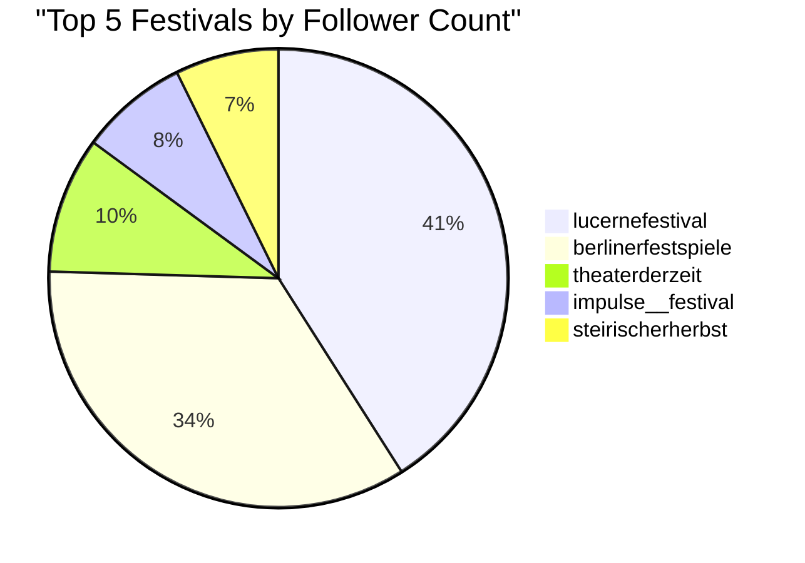
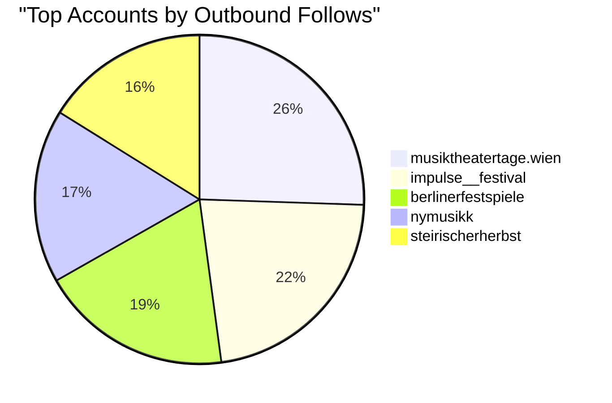
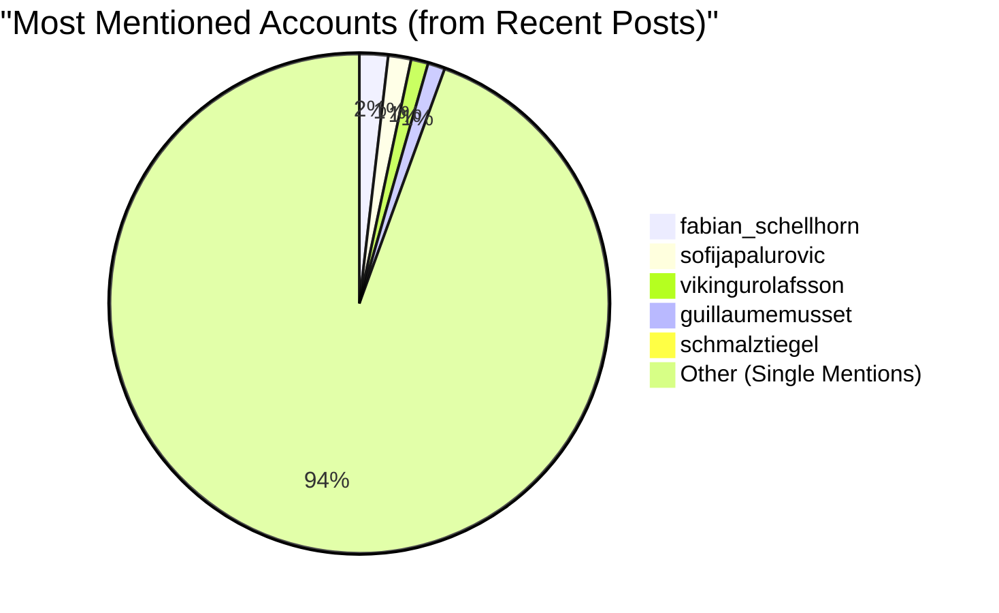
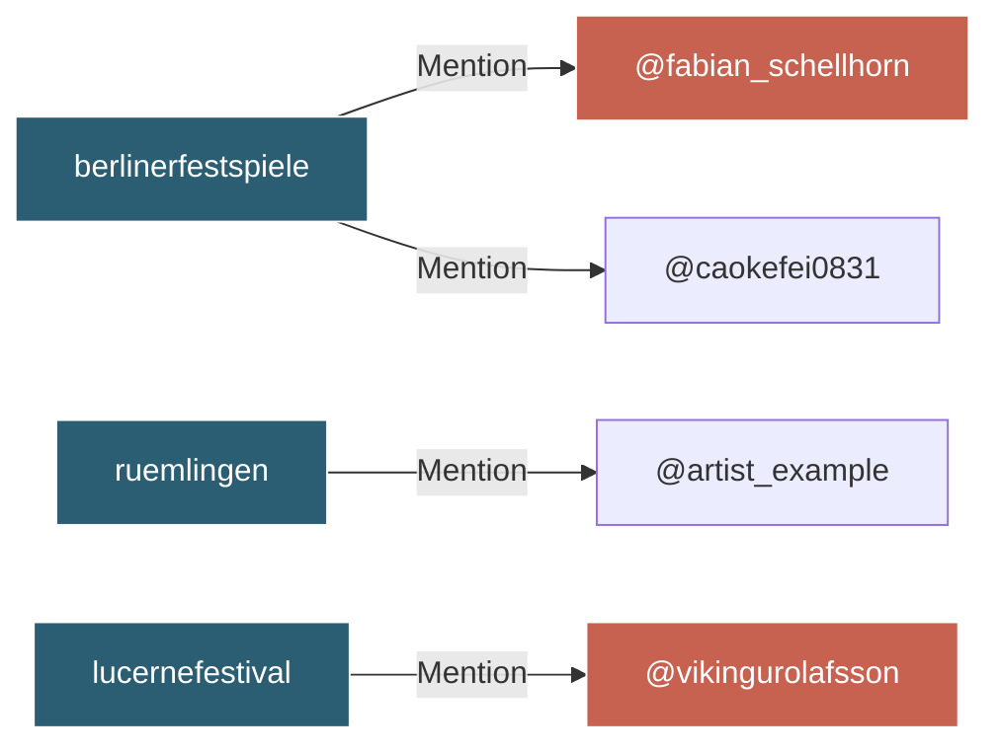

# Experimental Music Festival Network: Data Summary

This document provides a high-level summary and visual breakdown of the data extracted from the 18 target Instagram profiles and their recent posts.

## 📊 Audience Reach: Top 5 Profiles by Followers
The extracted data shows a massive variance in audience size among the target list, with major general-arts festivals naturally eclipsing specialized contemporary music entities.

## 🔄 Network Engagement: Top Accounts by 'Following'
A key metric for mapping networks is looking at how many accounts a profile follows. A high "following" count often indicates a highly engaged, community-centric account.

*Note: `musiktheatertage.wien` only has a fraction of the followers of `berlinerfestspiele`, but follows significantly more accounts, indicating a dense network mapping strategy on their part.*

## 🕸️ Network Graph: Top Mentioned Entities
By scanning the captions of the most recent posts across the ecosystem, the scraper uncovered **272 distinct outbound connections**. Below is a breakdown of the most frequently mentioned external entities in the current news cycle.

### Mention Graph Architecture
A simplified view of how the edge connections are structured based on the extracted data:

## 📋 Comprehensive Target Export Preview
The flat `client_export.csv` file distills the profile and post metadata into a single, easily readable row per target.

| Instagram Handle | Bio Snapshot | Followers | Following | External Link | Post Count |
| :--- | :--- | :--- | :--- | :--- | :--- |
| **lucernefestival** | Welcome to Lucerne Festival... | 66,014 | 1,168 | `lucernefestival.ch` | 2,423 |
| **berlinerfestspiele** | Contemporary arts festival... | 55,547 | 1,526 | `berlinerfestspiele.de` | 2,891 |
| **theaterderzeit** | Das Magazin für Theater... | 15,483 | 1,029 | `tdz.de` | 2,746 |
| **ruemlingen** | Festival Neue Musik... | 1,268 | 359 | `neue-musik-ruemlingen.ch` | 109 |
| **musiktexte.online** | Monatlich erscheinende... | 886 | 414 | `musiktexte.online` | 107 |

> [!NOTE]
> **Actionable Next Step:** Load the generated `data/network.graphml` file into a visualizer like **Gephi** to see the full, interactive spatial map of all 282 nodes and 272 edges.
